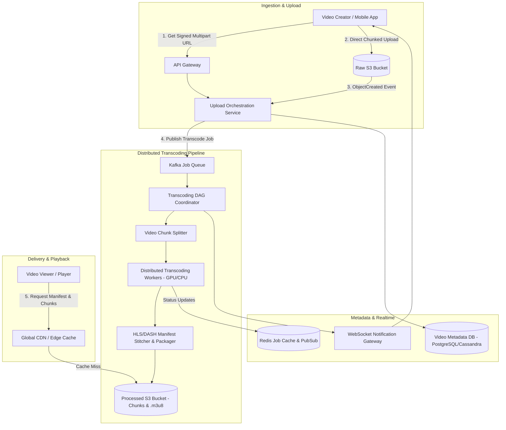
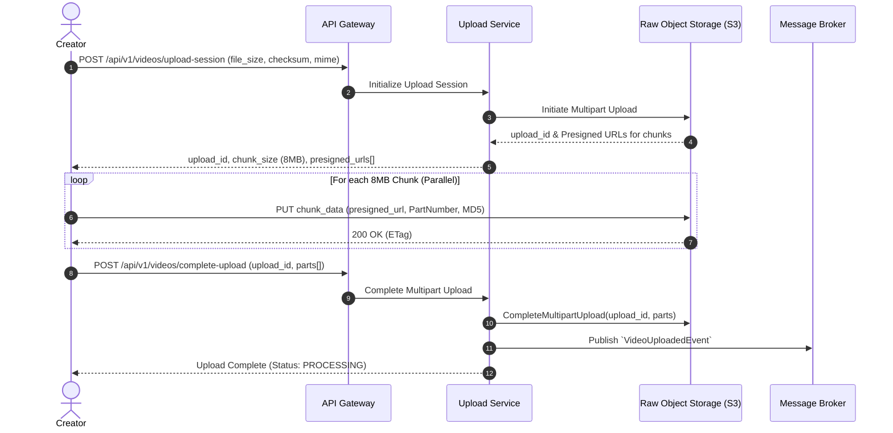
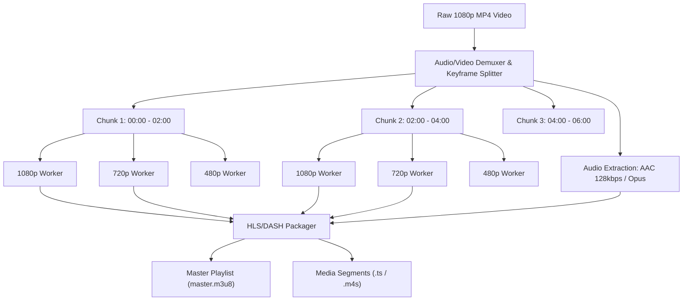
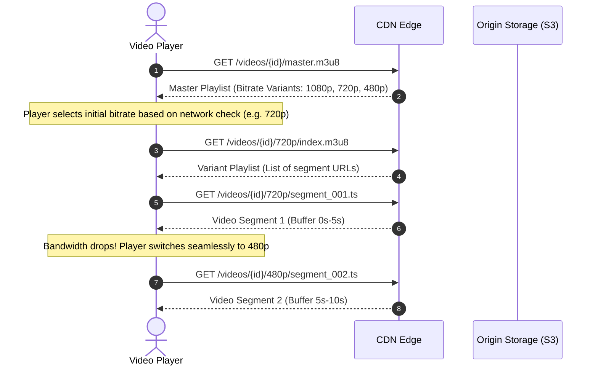

# System Design: Distributed Video Streaming & Transcoding Platform

A highly scalable, fault-tolerant video processing and on-demand streaming architecture (similar to YouTube or Netflix) designed to ingest, transcode, store, and stream millions of concurrent video streams globally with ultra-low latency, zero buffering, and adaptive bitrate switching.

---

## 1. Problem Statement

Building an Internet-scale video platform presents unique architectural challenges that differ fundamentally from standard transactional CRUD services:
- **Massive Binary Ingestion**: Millions of creators uploading multi-gigabyte raw video files concurrently over unreliable networks.
- **Heavy Compute Workloads**: Transcoding high-resolution source videos (4K, 1080p) into dozens of codecs (H.264, VP9, AV1), resolutions, and bitrates is CPU/GPU intensive and requires distributed DAG orchestration.
- **Zero Buffering & Adaptive Streaming**: Millions of global viewers stream videos over unpredictable network conditions (ranging from 3G mobile to gigabit fiber), requiring instant quality switching (ABR - Adaptive Bitrate Streaming via HLS/DASH).
- **Petabyte-Scale Storage & High CDN Costs**: Video represents >65% of global internet bandwidth. Storage and bandwidth costs must be optimized through intelligent tiered caching and hot/cold storage lifecycle management.

---

## 2. System Requirements

### Functional Requirements

| Requirement | Description |
| :--- | :--- |
| **Resumable Chunked Upload** | Creators can upload large video files in chunks with automatic retry on network drops. |
| **Distributed Transcoding** | Ingested raw video is automatically split, transcoded into multiple formats/resolutions, and packaged into HLS/DASH playlists. |
| **Adaptive Bitrate Streaming (ABR)** | Viewers can stream video smoothly; quality switches seamlessly between 240p to 4K based on available bandwidth. |
| **Video Metadata & Search** | Users can search, view metadata, like, comment, and track video view counts in real time. |
| **Thumbnails & Storyboard Generation** | Auto-extracts high-res preview thumbnails and scrub-bar storyboards during transcoding. |

### Non-Functional Requirements

| Requirement | Target Metric | Architectural Approach |
| :--- | :--- | :--- |
| **Low Playback Startup Latency** | Time-to-first-frame < 200ms | CDN edge caching, pre-warmed connections, optimized initial chunk size (2s-4s). |
| **High Availability** | 99.99% playback availability | Multi-region CDN routing, geo-distributed object storage replicas. |
| **Scalability** | 100M+ DAU, 1M concurrent streams | Stateless API tier, asynchronous Kafka/SQS task queues, auto-scaling worker fleet. |
| **Data Durability & Reliability** | Zero raw/transcoded video loss | Erasure-coded multi-AZ object storage (S3/GCS) with lifecycle policies. |
| **Bandwidth & Cost Efficiency** | Minimized egress costs | Tiered CDN caching (Edge Point-of-Presence -> Regional Shield -> Origin), modern codecs (AV1/VP9). |

---

## 3. Scale & Capacity Estimations

### User & Traffic Numbers
- **Daily Active Users (DAU)**: 100 Million
- **Daily Video Uploads**: 500,000 videos/day
- **Average Video Duration**: 10 minutes
- **Raw Upload Size**: ~500 MB average (1080p raw upload)
- **Daily View Count**: 1 Billion views/day
- **Average Viewing Time per User**: 30 minutes/day

### Storage & Ingestion Estimations
```text
Daily Raw Ingest:
  500,000 videos * 500 MB = 250 TB / day
  Ingest Bandwidth = 250 TB / 86,400s ≈ 23 Gbps average (Peak ~60 Gbps)

Transcoding Multiplier:
  Each video is encoded into 5 resolutions (1080p, 720p, 480p, 360p, 240p).
  Total transcoded storage ≈ 1.5x raw size = 375 TB / day.
  Annual Storage Required ≈ 375 TB * 365 ≈ 136.8 PB / year.

Streaming Egress Bandwidth:
  Average Bitrate (Across 720p/1080p mix) ≈ 2.5 Mbps
  Total Concurrent Viewers at Peak (10% DAU) = 10,000,000 concurrent streams
  Peak CDN Egress Bandwidth = 10M streams * 2.5 Mbps = 25 Tbps (Handled by Global CDNs)
```

---

## 4. High-Level Architecture



---

## 5. End-to-End Workflows

### 5.1 Resumable Chunked Video Upload

Direct-to-storage upload reduces API gateway load and avoids double-hop buffering:



---

### 5.2 Distributed Transcoding DAG (Directed Acyclic Graph)

A 10-minute video is not processed as a single monolithic file. It is broken into independent Group-of-Pictures (GOP) chunks and processed in parallel across hundreds of workers:



---

### 5.3 Adaptive Bitrate Streaming (ABR) Playback

The client-side video player continually samples network throughput and buffer fill levels to request the optimal segment quality:



---

## 6. Detailed Documentation

Explore in-depth design documents for each component:

* 📐 [Detailed Architecture & Component Deep Dive](file:///Users/rummansiddiqui/Downloads/systemdesigns/system-design-video-streaming/docs/architecture.md)
* 🔌 [API Contracts & Endpoints](file:///Users/rummansiddiqui/Downloads/systemdesigns/system-design-video-streaming/docs/api_design.md)
* 📊 [Capacity Planning & Bandwidth Math](file:///Users/rummansiddiqui/Downloads/systemdesigns/system-design-video-streaming/docs/capacity_planning.md)
* ⚙️ [Distributed Transcoding DAG Pipeline](file:///Users/rummansiddiqui/Downloads/systemdesigns/system-design-video-streaming/docs/transcoding_pipeline_dag.md)
* 📡 [HLS & DASH Adaptive Bitrate Streaming](file:///Users/rummansiddiqui/Downloads/systemdesigns/system-design-video-streaming/docs/hls_dash_streaming.md)
* 🗄️ [Database Schema & Data Model](file:///Users/rummansiddiqui/Downloads/systemdesigns/system-design-video-streaming/docs/database_schema.md)
* 🌐 [CDN & Edge Caching Strategy](file:///Users/rummansiddiqui/Downloads/systemdesigns/system-design-video-streaming/docs/cdn_and_caching_strategy.md)
* 🛡️ [Failure Scenarios & Resilience](file:///Users/rummansiddiqui/Downloads/systemdesigns/system-design-video-streaming/docs/failure_scenarios.md)

---

## 7. Examples & Reference

* 📄 [Master & Variant HLS Playlist Sample](file:///Users/rummansiddiqui/Downloads/systemdesigns/system-design-video-streaming/examples/master_playlist.m3u8)
* 📦 [Sample Transcoding Event Payload](file:///Users/rummansiddiqui/Downloads/systemdesigns/system-design-video-streaming/examples/sample_transcoding_job.json)
* 💻 [Chunking & ABR Pseudo-code](file:///Users/rummansiddiqui/Downloads/systemdesigns/system-design-video-streaming/examples/pseudo_code.md)

---

## License

This project is licensed under the MIT License - see the [LICENSE](file:///Users/rummansiddiqui/Downloads/systemdesigns/system-design-video-streaming/LICENSE) file for details.
