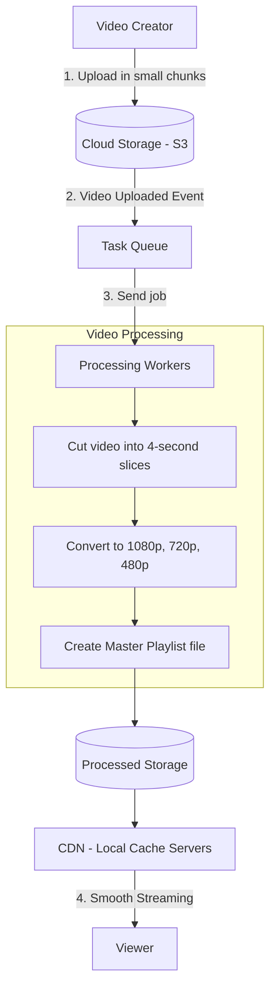
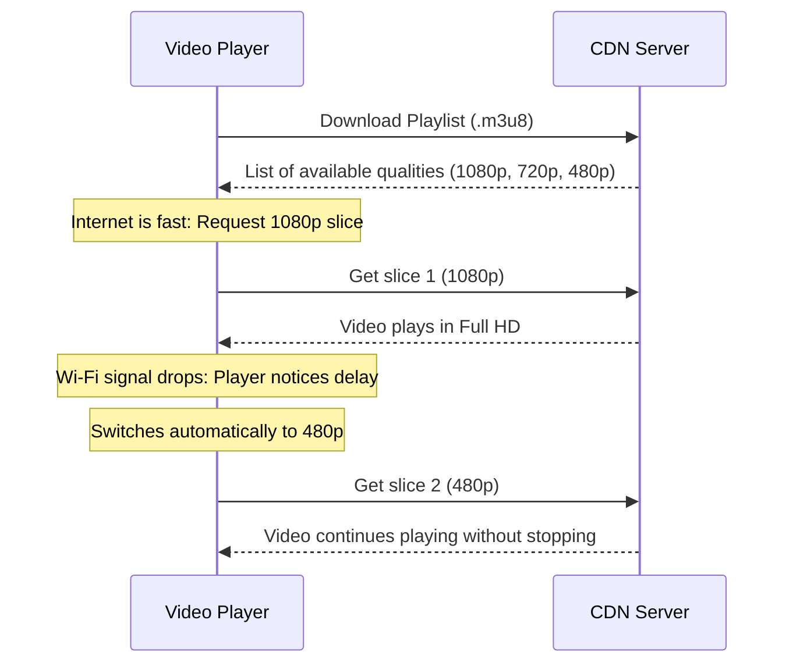

# System Design: Video Streaming Platform

A practical, beginner-friendly system design of a large-scale video streaming and processing platform (like YouTube or Netflix). It explains how videos are uploaded, processed into multiple video qualities, stored, and streamed smoothly across the world without buffering.

---

## 1. The Core Problem

When you watch or upload a video on the internet, several simple but critical challenges happen:

1. **Different Internet Speeds:** One viewer has fast fiber Wi-Fi, while another has a weak mobile signal. If we send the same heavy 4K file to everyone, slow internet users will experience constant buffering.
2. **Different Screen Sizes:** A mobile phone screen does not need a massive 4K file, while a 65-inch Smart TV needs high definition.
3. **Large File Uploads:** Uploading a large video (1 GB or more) over home internet can fail midway. The system must allow resuming the upload from where it stopped instead of starting over.
4. **Fast Delivery Worldwide:** Viewers should not experience delays or waiting times, no matter where they are located.

---

## 2. System Requirements

### Functional Requirements (What the system does)

| Requirement | What it Means |
| :--- | :--- |
| **Resumable Upload** | Creators can upload large video files in small chunks. If the internet disconnects, the upload continues from where it stopped. |
| **Video Processing (Transcoding)** | The system converts one uploaded video into multiple quality levels (1080p, 720p, 480p, 360p). |
| **Adaptive Quality Streaming** | The video automatically adjusts its quality based on the viewer's current internet speed (faster internet = better quality, slower internet = lower quality without stopping). |
| **Video Details & Search** | Users can search videos, view titles and descriptions, like, and track view counts. |
| **Thumbnails & Preview** | The system automatically creates preview images (thumbnails) and hover previews. |

### Non-Functional Requirements (How well it performs)

| Requirement | Target | Simple Explanation |
| :--- | :--- | :--- |
| **Fast Video Start** | Under 1 second | When a user clicks play, the first video frame should appear almost instantly. |
| **High Availability** | 99.99% uptime | The website and video player should always work without going down. |
| **Scalability** | Millions of viewers | The system can handle sudden traffic spikes when a video goes viral. |
| **Smooth Playback** | No buffering | Video quality drops smoothly instead of freezing when internet speed drops. |

---

## 3. Scale Estimations & Detailed Calculations

Below is the complete mathematical breakdown of traffic, storage, and network bandwidth for a system serving 100 Million Daily Active Users (DAU).

---

### 3.1 Traffic & Request Rates (QPS)

* **Daily Active Users (DAU):** 100 Million
* **Daily Video Uploads:** 500,000 videos / day
* **Daily Video Views:** 1 Billion views / day (average 10 views per user)
* **Average Video Length:** 10 minutes (600 seconds)

#### Uploads per Second (Upload QPS)
$$\text{Average Upload QPS} = \frac{500,000 \text{ uploads}}{86,400 \text{ seconds/day}} \approx 5.78 \text{ uploads/second}$$
$$\text{Peak Upload QPS (3x peak factor)} = 5.78 \times 3 \approx 17.3 \text{ uploads/second}$$

#### Video Views per Second (Playback QPS)
$$\text{Average View QPS} = \frac{1,000,000,000 \text{ views}}{86,400 \text{ seconds/day}} \approx 11,574 \text{ views/second}$$
$$\text{Peak View QPS (3x peak factor)} = 11,574 \times 3 \approx 34,722 \text{ views/second}$$

---

### 3.2 Storage Calculations

#### Step 1: Raw Video Upload Size
* Average raw 1080p video bitrate = **6.67 Mbps**
* Size of one 10-minute raw video:
  $$\text{Raw File Size} = 600 \text{ seconds} \times \frac{6.67 \text{ Megabits/sec}}{8 \text{ bits/byte}} = 600 \times 0.833 \text{ MB/sec} \approx 500 \text{ MB}$$

* Total daily raw storage:
  $$\text{Daily Raw Storage} = 500,000 \text{ uploads} \times 500 \text{ MB} = 250,000,000 \text{ MB} = 250 \text{ TB / day}$$

#### Step 2: Converted (Transcoded) Resolutions Size
Each uploaded video is converted into 4 quality levels for adaptive streaming:

| Resolution | Video Bitrate | Formula | Size for 10-min Video |
| :--- | :--- | :--- | :--- |
| **1080p (Full HD)** | 4.5 Mbps | $600 \text{s} \times (4.5 / 8) \text{ MB/s}$ | $337.5 \text{ MB}$ |
| **720p (HD)** | 2.2 Mbps | $600 \text{s} \times (2.2 / 8) \text{ MB/s}$ | $165.0 \text{ MB}$ |
| **480p (SD)** | 1.0 Mbps | $600 \text{s} \times (1.0 / 8) \text{ MB/s}$ | $75.0 \text{ MB}$ |
| **360p (Low)** | 0.5 Mbps | $600 \text{s} \times (0.5 / 8) \text{ MB/s}$ | $37.5 \text{ MB}$ |
| **Total Converted per Video** | — | **Sum of all 4 resolutions** | **615.0 MB** |

* Total daily converted storage:
  $$\text{Daily Transcoded Storage} = 500,000 \text{ uploads} \times 615 \text{ MB} = 307,500,000 \text{ MB} = 307.5 \text{ TB / day}$$

#### Step 3: Total Combined Daily & Annual Storage
$$\text{Total Daily Storage} = 250 \text{ TB (Raw)} + 307.5 \text{ TB (Transcoded)} = 557.5 \text{ TB / day}$$
$$\text{1-Year Storage Required} = 557.5 \text{ TB/day} \times 365 \text{ days} \approx 203,487 \text{ TB} \approx 203.5 \text{ Petabytes (PB) / year}$$

---

### 3.3 Network Bandwidth Calculations

#### Inbound Upload Bandwidth (Ingestion)
$$\text{Average Inbound Bandwidth} = \frac{250 \text{ TB} \times 8 \times 10^6 \text{ Megabits}}{86,400 \text{ seconds}} \approx 23,148 \text{ Mbps} \approx 23.15 \text{ Gbps}$$
$$\text{Peak Inbound Bandwidth (2.5x)} = 23.15 \text{ Gbps} \times 2.5 \approx 57.87 \text{ Gbps}$$

#### Outbound Streaming Bandwidth (Egress via CDN)
* Average daily watch time per user = **30 minutes**
* Total viewing time per day across all users:
  $$\text{Total Daily Watch Time} = 100,000,000 \text{ users} \times 30 \text{ minutes} = 3,000,000,000 \text{ minutes / day}$$

* Average concurrent video streams running at any given minute:
  $$\text{Average Concurrent Streams} = \frac{3,000,000,000 \text{ minutes}}{1,440 \text{ minutes in a day}} \approx 2,083,333 \text{ active streams}$$

* Peak concurrent streams during busy evening hours (3.5x peak factor):
  $$\text{Peak Concurrent Streams} = 2,083,333 \times 3.5 \approx 7,291,665 \text{ streams} \approx 7.3 \text{ Million streams}$$

* Average playback bitrate across all viewers (mix of 1080p, 720p, 480p) = **2.5 Mbps**:
  $$\text{Peak Egress Bandwidth} = 7,291,665 \text{ streams} \times 2.5 \text{ Mbps} = 18,229,162 \text{ Mbps} \approx 18.23 \text{ Terabits per second (Tbps)}$$

> **Key Takeaway:** Delivering **18.23 Tbps** directly from central data centers is impossible and cost-prohibitive. This traffic is served by caching video slices on global **Content Delivery Networks (CDNs)** near the users.

---

## 4. How the System Works (Step-by-Step)

### Step 1: Uploading the Video
Instead of sending a huge file in one piece, the creator's browser breaks the file into small 8 MB parts. Each part is sent directly to cloud storage. If a single part fails, only that 8 MB part is retried.

### Step 2: Breaking the Video into Slices
A 10-minute video is split into hundreds of 4-second small slices. Multiple background worker computers process these slices at the same time, which makes video conversion very fast.

### Step 3: Creating Multiple Qualities
Each slice is converted into standard resolutions:
* 1080p (Full HD - for fast Wi-Fi)
* 720p (HD - for standard internet)
* 480p (SD - for mobile data)
* 360p (Low - for weak signals)

### Step 4: Creating the Playlist File (.m3u8)
The system creates an index text file (called a Playlist or Manifest). This file acts like a table of contents, telling the video player where each 4-second slice is located for each quality level.

### Step 5: Delivering through CDNs
Instead of every viewer fetching video files from one central server, copies of popular video slices are stored on local servers (CDNs) close to the user's city.

---

## 5. What is Adaptive Bitrate Streaming (ABR)?

Adaptive Bitrate Streaming is the technology that stops video buffering:

1. The video player in your browser or phone downloads the first 4-second slice.
2. It measures how fast that slice was downloaded.
3. If your connection is fast, it asks for the next slice in **1080p**.
4. If your connection slows down, it asks for the next slice in **480p**.
5. The switch happens seamlessly in the background without any spinning wheel or playback stop.

---

## 6. Project Documentation

Read detailed guides on every component of this design:

* [System Architecture & Components](file:///Users/rummansiddiqui/Downloads/systemdesigns/system-design-video-streaming/docs/architecture.md)
* [API Design & Endpoints](file:///Users/rummansiddiqui/Downloads/systemdesigns/system-design-video-streaming/docs/api_design.md)
* [Capacity Planning & Math](file:///Users/rummansiddiqui/Downloads/systemdesigns/system-design-video-streaming/docs/capacity_planning.md)
* [Transcoding Pipeline & Workflows](file:///Users/rummansiddiqui/Downloads/systemdesigns/system-design-video-streaming/docs/transcoding_pipeline_dag.md)
* [HLS & DASH Streaming Explained](file:///Users/rummansiddiqui/Downloads/systemdesigns/system-design-video-streaming/docs/hls_dash_streaming.md)
* [Database Schema & Data Model](file:///Users/rummansiddiqui/Downloads/systemdesigns/system-design-video-streaming/docs/database_schema.md)
* [CDN & Caching Strategy](file:///Users/rummansiddiqui/Downloads/systemdesigns/system-design-video-streaming/docs/cdn_and_caching_strategy.md)
* [Failure Handling & Recovery](file:///Users/rummansiddiqui/Downloads/systemdesigns/system-design-video-streaming/docs/failure_scenarios.md)

---

## 7. Code & Examples

* [Sample HLS Master Playlist](file:///Users/rummansiddiqui/Downloads/systemdesigns/system-design-video-streaming/examples/master_playlist.m3u8)
* [Sample Transcoding Task Event](file:///Users/rummansiddiqui/Downloads/systemdesigns/system-design-video-streaming/examples/sample_transcoding_job.json)
* [Transcoder & Player Code Examples](file:///Users/rummansiddiqui/Downloads/systemdesigns/system-design-video-streaming/examples/pseudo_code.md)

---

## License

This project is licensed under the MIT License - see the [LICENSE](file:///Users/rummansiddiqui/Downloads/systemdesigns/system-design-video-streaming/LICENSE) file for details.
