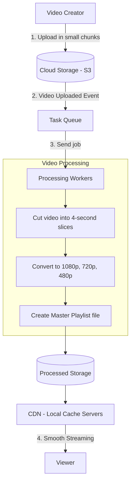
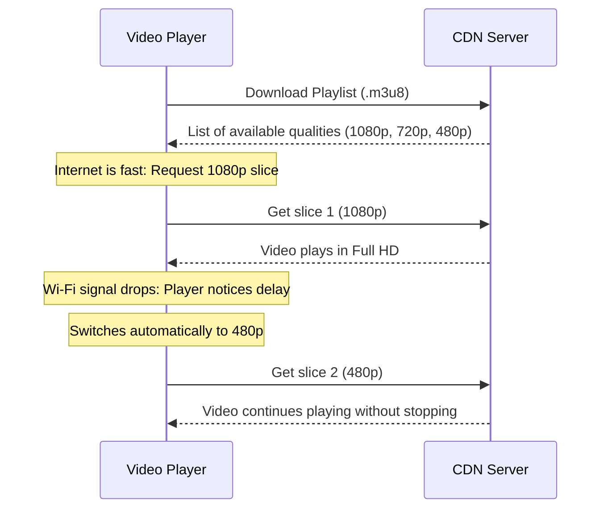

# System Design: Video Streaming Platform

A practical, beginner-friendly system design of a large-scale video streaming and processing platform (like YouTube or Netflix). It explains how videos are uploaded, processed into multiple video qualities, stored, and streamed smoothly across the world without buffering.

---

## 1. The Core Problem

When you watch or upload a video on the internet, several simple but critical challenges happen:

1. **Different Internet Speeds:** One viewer has fast fiber Wi-Fi, while another has a weak mobile signal. If we send the same heavy 4K file to everyone, slow internet users will experience constant buffering.
2. **Different Screen Sizes:** A mobile phone screen does not need a massive 4K file, while a 65-inch Smart TV needs high definition.
3. **Large File Uploads:** Uploading a large video (1 GB or more) over home internet can fail midway. The system must allow resuming the upload from where it stopped instead of starting over.
4. **Fast Delivery Worldwide:** Viewers should not experience delays or waiting times, no matter where they are located.

---

## 2. System Requirements

### Functional Requirements (What the system does)

| Requirement | What it Means |
| :--- | :--- |
| **Resumable Upload** | Creators can upload large video files in small chunks. If the internet disconnects, the upload continues from where it stopped. |
| **Video Processing (Transcoding)** | The system converts one uploaded video into multiple quality levels (1080p, 720p, 480p, 360p). |
| **Adaptive Quality Streaming** | The video automatically adjusts its quality based on the viewer's current internet speed (faster internet = better quality, slower internet = lower quality without stopping). |
| **Video Details & Search** | Users can search videos, view titles and descriptions, like, and track view counts. |
| **Thumbnails & Preview** | The system automatically creates preview images (thumbnails) and hover previews. |

### Non-Functional Requirements (How well it performs)

| Requirement | Target | Simple Explanation |
| :--- | :--- | :--- |
| **Fast Video Start** | Under 1 second | When a user clicks play, the first video frame should appear almost instantly. |
| **High Availability** | 99.99% uptime | The website and video player should always work without going down. |
| **Scalability** | Millions of viewers | The system can handle sudden traffic spikes when a video goes viral. |
| **Smooth Playback** | No buffering | Video quality drops smoothly instead of freezing when internet speed drops. |

---

## 3. Scale Estimations (Simple Numbers)

To understand the system's size, let us look at a platform with 100 Million daily active users:

* **Daily Video Uploads:** 500,000 new videos per day.
* **Average Video Length:** 10 minutes.
* **Daily Total Views:** 1 Billion views per day.
* **Storage Needed Daily:**
  * Raw uploaded files = ~250 Terabytes per day.
  * Converted formats (1080p, 720p, 480p, etc.) = ~350 Terabytes per day.
  * Total new storage needed each day = ~600 Terabytes.
* **Peak Streaming Bandwidth:** During busy evening hours, around 7 Million people watch videos at the exact same second. Global distribution networks (CDNs) handle this load.

---

## 4. How the System Works (Step-by-Step)

### Step 1: Uploading the Video
Instead of sending a huge file in one piece, the creator's browser breaks the file into small 8 MB parts. Each part is sent directly to cloud storage. If a single part fails, only that 8 MB part is retried.

### Step 2: Breaking the Video into Slices
A 10-minute video is split into hundreds of 4-second small slices. Multiple background worker computers process these slices at the same time, which makes video conversion very fast.

### Step 3: Creating Multiple Qualities
Each slice is converted into standard resolutions:
* 1080p (Full HD - for fast Wi-Fi)
* 720p (HD - for standard internet)
* 480p (SD - for mobile data)
* 360p (Low - for weak signals)

### Step 4: Creating the Playlist File (.m3u8)
The system creates an index text file (called a Playlist or Manifest). This file acts like a table of contents, telling the video player where each 4-second slice is located for each quality level.

### Step 5: Delivering through CDNs
Instead of every viewer fetching video files from one central server, copies of popular video slices are stored on local servers (CDNs) close to the user's city.

---

## 5. What is Adaptive Bitrate Streaming (ABR)?

Adaptive Bitrate Streaming is the technology that stops video buffering:

1. The video player in your browser or phone downloads the first 4-second slice.
2. It measures how fast that slice was downloaded.
3. If your connection is fast, it asks for the next slice in **1080p**.
4. If your connection slows down, it asks for the next slice in **480p**.
5. The switch happens seamlessly in the background without any spinning wheel or playback stop.

---

## 6. Project Documentation

Read detailed guides on every component of this design:

* [System Architecture & Components](file:///Users/rummansiddiqui/Downloads/systemdesigns/system-design-video-streaming/docs/architecture.md)
* [API Design & Endpoints](file:///Users/rummansiddiqui/Downloads/systemdesigns/system-design-video-streaming/docs/api_design.md)
* [Capacity Planning & Math](file:///Users/rummansiddiqui/Downloads/systemdesigns/system-design-video-streaming/docs/capacity_planning.md)
* [Transcoding Pipeline & Workflows](file:///Users/rummansiddiqui/Downloads/systemdesigns/system-design-video-streaming/docs/transcoding_pipeline_dag.md)
* [HLS & DASH Streaming Explained](file:///Users/rummansiddiqui/Downloads/systemdesigns/system-design-video-streaming/docs/hls_dash_streaming.md)
* [Database Schema & Data Model](file:///Users/rummansiddiqui/Downloads/systemdesigns/system-design-video-streaming/docs/database_schema.md)
* [CDN & Caching Strategy](file:///Users/rummansiddiqui/Downloads/systemdesigns/system-design-video-streaming/docs/cdn_and_caching_strategy.md)
* [Failure Handling & Recovery](file:///Users/rummansiddiqui/Downloads/systemdesigns/system-design-video-streaming/docs/failure_scenarios.md)

---

## 7. Code & Examples

* [Sample HLS Master Playlist](file:///Users/rummansiddiqui/Downloads/systemdesigns/system-design-video-streaming/examples/master_playlist.m3u8)
* [Sample Transcoding Task Event](file:///Users/rummansiddiqui/Downloads/systemdesigns/system-design-video-streaming/examples/sample_transcoding_job.json)
* [Transcoder & Player Code Examples](file:///Users/rummansiddiqui/Downloads/systemdesigns/system-design-video-streaming/examples/pseudo_code.md)

---

## License

This project is licensed under the MIT License - see the [LICENSE](file:///Users/rummansiddiqui/Downloads/systemdesigns/system-design-video-streaming/LICENSE) file for details.
