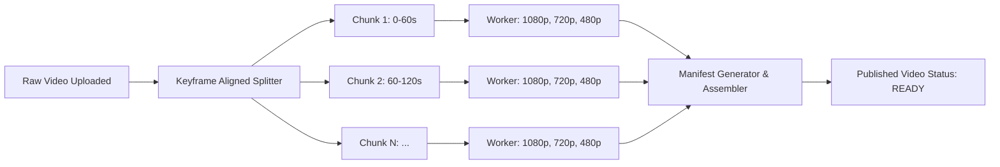
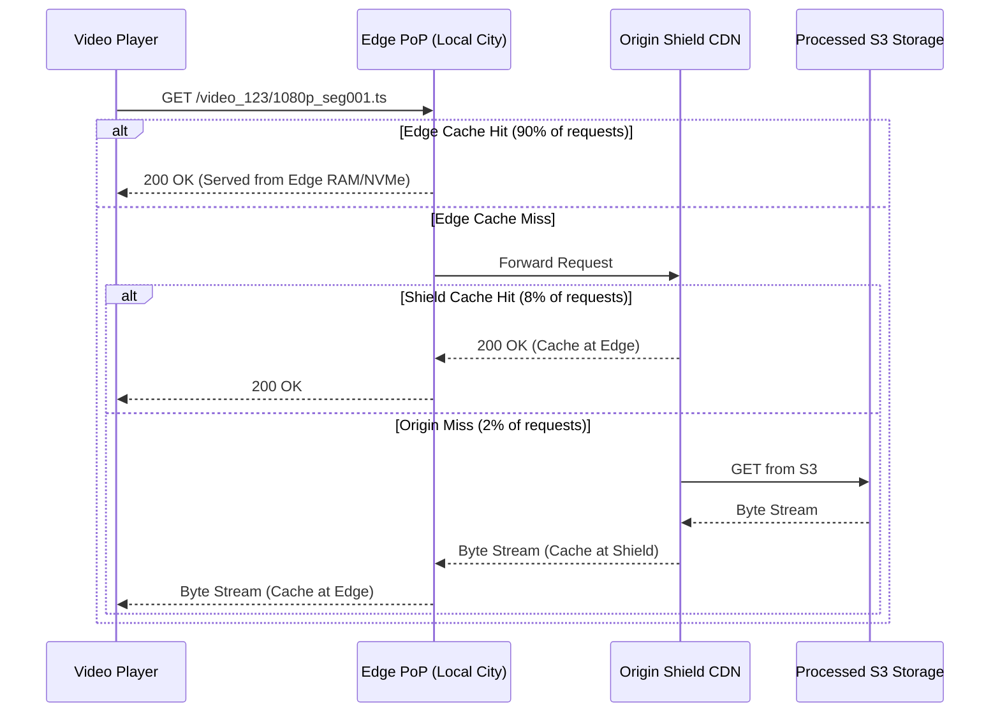
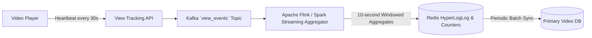

# Architecture Deep Dive: Distributed Video Streaming Platform

This document details the internal sub-systems, component communication patterns, and architectural trade-offs of the video ingestion, transcoding, and content delivery infrastructure.

---

## 1. Architectural Tiers

The system is organized into four decoupled planes:

```mermaid
graph TD
    subgraph Control Plane
        API[API Gateway]
        Auth[Auth / Session Service]
        MetadataSvc[Metadata & Search Service]
        BillingSvc[Subscription / Ad Service]
    end

    subgraph Ingestion & Processing Plane
        UploadSvc[Upload Orchestrator]
        DAGScheduler[Distributed DAG Coordinator]
        WorkerFleet[Transcoding Worker Fleet]
        Packager[HLS/DASH Manifest Packager]
    end

    subgraph Storage Plane
        RawS3[(Raw Ingest S3)]
        ProcessedS3[(Segment & Playlist S3)]
        DocDB[(Metadata Document DB)]
        TimeDB[(Time-series View DB)]
        Cache[(Redis Cache Cluster)]
    end

    subgraph Delivery & Edge Plane
        DNS[Geo-DNS / Anycast Routing]
        EdgeCDN[Global Edge CDN (PoPs)]
        RegionalShield[Regional Origin Shield]
    end

    API --> MetadataSvc & UploadSvc
    UploadSvc --> RawS3 & DAGScheduler
    DAGScheduler --> WorkerFleet --> Packager --> ProcessedS3
    DNS --> EdgeCDN --> RegionalShield --> ProcessedS3
```

---

## 2. Ingestion Plane: Direct-to-Storage Pattern

### Why Avoid Ingesting Through Application Gateways?
Routing multi-gigabyte video uploads through standard HTTP API gateways introduces severe operational problems:
- Gateways become memory and socket-bound, causing connection starvation for lightweight REST calls.
- Proxy timeouts and connection drops abort long-running uploads.
- Double data transfer: Client -> Gateway -> Storage doubles inbound bandwidth costs.

### Presigned S3 Multipart Flow
1. **Client Handshake**: Client requests an upload ticket with `file_size`, `filename`, and `sha256_hash`.
2. **Session Initialization**: The `Upload Service` calls AWS S3 / GCS to initialize a Multipart Upload, creating an `upload_id` and generating pre-signed URLs for each 8MB to 16MB part.
3. **Parallel Ingestion**: Client uploads parts directly to S3 concurrently (e.g., 4 parallel worker threads).
4. **Completion & Validation**: Once all parts are uploaded, client sends a commit request. The Upload Service verifies part ETags and triggers S3 `CompleteMultipartUpload`.

---

## 3. Distributed Processing Plane (DAG Orchestrator)

### The Splitting & Transcoding Pipeline
Transcoding an entire 2-hour 4K movie on a single machine takes hours. Our architecture breaks media down into independent **Group of Pictures (GOP)** segments at keyframe boundaries.



* **Chunk Size Optimization**: Segments are split into 2-second to 6-second slices aligned on I-frames (Keyframes). 
* **Worker Heterogeneity**: GPU workers (NVENC / QuickSync) handle compute-heavy 4K / 1080p AV1 encoding; cheaper CPU spot instances handle 360p / 240p H.264 fallbacks.
* **Idempotent Tasks**: Each chunk task is identified by `(video_id, chunk_index, target_codec, target_resolution)`. Retries simply overwrite the destination key in S3.

---

## 4. Delivery Plane: Multi-Tiered CDN Caching



### Dynamic Origin Shielding
To prevent the "Thundering Herd" problem when a major live event or viral video drops, an **Origin Shield layer** aggregates misses from hundreds of global edge PoPs, ensuring that only a single request for a new video chunk ever touches the underlying S3 storage.

---

## 5. View Count Aggregation Pipeline

Updating a database row `views = views + 1` directly on every video playback creates massive row-level write lock contention on viral videos.



* **Deduplication**: Redis HyperLogLog tracks `(user_id, video_id, date)` to prevent spam/bot view inflation.
* **Real-time Counts**: Real-time read queries read from Redis counters, while durable batch updates flush to the primary database every 10 seconds.
