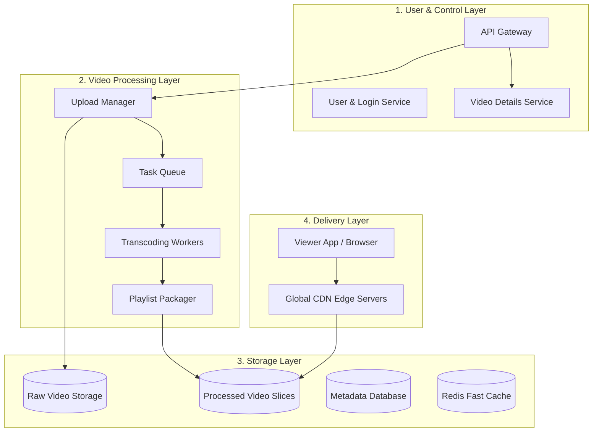
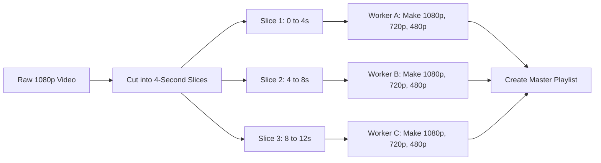
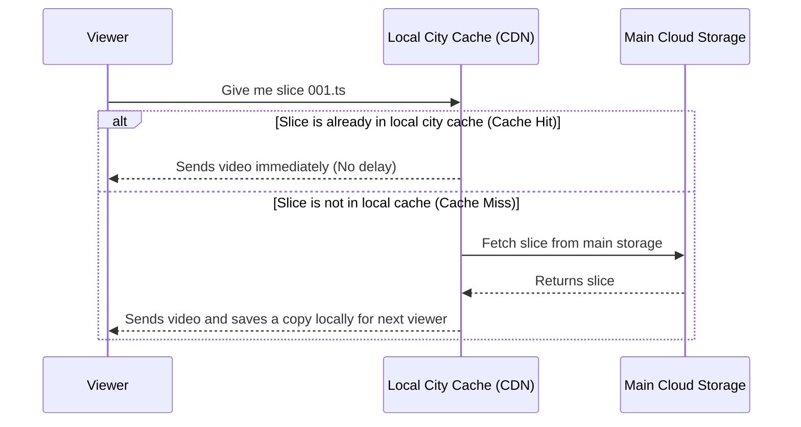
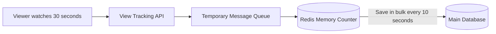

# System Architecture: Video Streaming Platform

This document explains the main components of the video streaming system and how they talk to each other in simple terms.

---

## 1. The Four Main Parts of the System

To keep things organized, the system is split into four simple layers:

---

## 2. Part 1: How Videos are Uploaded (Direct Upload)

### Why not upload directly to the main web server?
If a creator uploads a 2 GB video through the normal website server, two bad things happen:
* The web server gets busy holding this huge file in memory and slows down for everyone else.
* If the user's connection drops at 95%, the whole upload is lost.

### The Solution: Direct Multipart Upload
1. The user asks the API for permission to upload a video.
2. The API gives the user special temporary upload links (called presigned URLs) directly to cloud storage (like Amazon S3).
3. The user's browser breaks the video into 8 MB parts and uploads them directly to cloud storage in parallel.
4. Once all parts finish, cloud storage puts the parts together into the final raw file and informs the system.

---

## 3. Part 2: How Videos are Processed (Transcoding)

Transcoding means converting one video into multiple resolutions and formats.

* **Why cut into 4-second slices?**
  If we try to convert a 2-hour movie on one single computer, it takes hours. But if we split it into small 4-second slices, 50 worker computers can work on different slices at the exact same time. The video gets ready in just a few minutes.
* **Smart Failure Recovery:**
  If Worker B crashes while working on Slice 2, the system automatically gives Slice 2 to another worker without having to restart the whole video.

---

## 4. Part 3: Delivering Videos with CDN

* **What is a CDN?**
  A Content Delivery Network (CDN) is a network of servers placed in hundreds of cities worldwide.
* When a popular video is uploaded, its slices are cached on servers near viewers. A viewer in Tokyo gets the video from Tokyo, and a viewer in London gets it from London.

---

## 5. Part 4: Counting Views Without Crashing

When a video goes viral and millions of people watch it at the same second, updating a database row (`views = views + 1`) millions of times per second will lock the database and crash the site.

* View counts are first incremented in super-fast memory (Redis).
* Every 10 seconds, the totals are written in bulk to the main database. This keeps the database fast and healthy.
