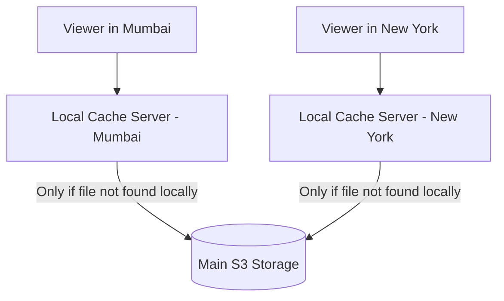

# CDN & Caching Strategy

This document explains how video files are cached across global edge servers to save network costs and provide instant playback.

---

## 1. Why Do We Need a CDN for Video?

Without a CDN:
* If a server is in Virginia, USA, a viewer in India or Japan has to wait 200 to 300 milliseconds for every single packet.
* Millions of viewers would hit the same central storage server, overloading it and causing slow buffering.

With a CDN:
* Copies of video slices are stored on servers in hundreds of local cities.
* A viewer in Tokyo gets the video from a Tokyo data center in under 10 milliseconds.

---

## 2. Why Video Slices are Easy to Cache

Unlike user balances or bank accounts that change frequently, video slices are **immutable** (they never change once created):

* Once `slice_001.ts` is created and uploaded, its content stays the same forever.
* We can set the cache rule to `Cache-Control: public, max-age=31536000` (cache for 1 year).
* Edge servers can keep popular video slices in their fast local NVMe drives and serve them to thousands of viewers without ever asking the main server again.

---

## 3. Saving Money on Old Videos (Storage Lifecycle)

Most video views happen during the first two weeks after upload. To save storage costs on older videos:

1. **Hot Tier (First 30 Days):** All qualities (1080p, 720p, 480p, 360p) are kept in fast standard cloud storage.
2. **Warm Tier (After 30 Days):** Move files to Infrequent Access storage (cheaper per GB).
3. **Cold Archive (After 90 Days with few views):** Keep the master raw video in cheap deep archive storage. If it ever becomes viral again, the system can quickly regenerate the modern web slices.
