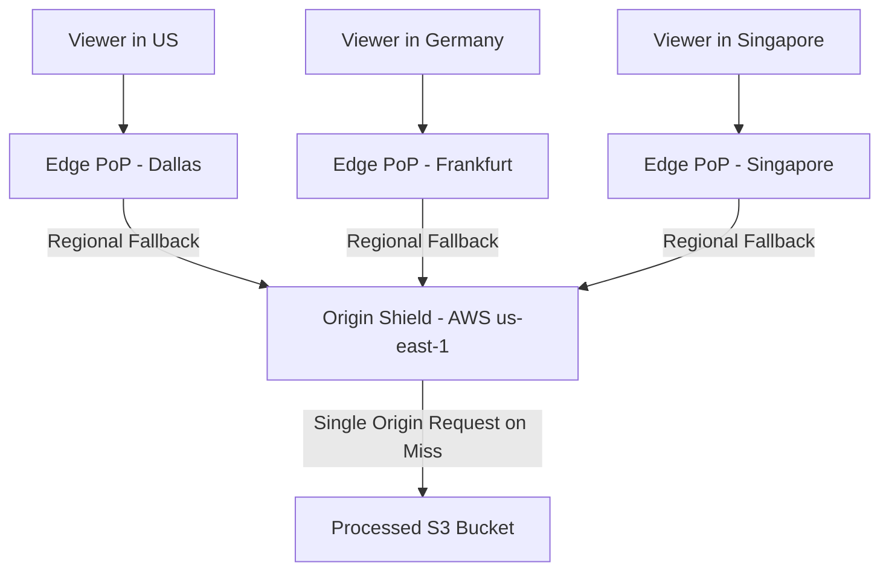
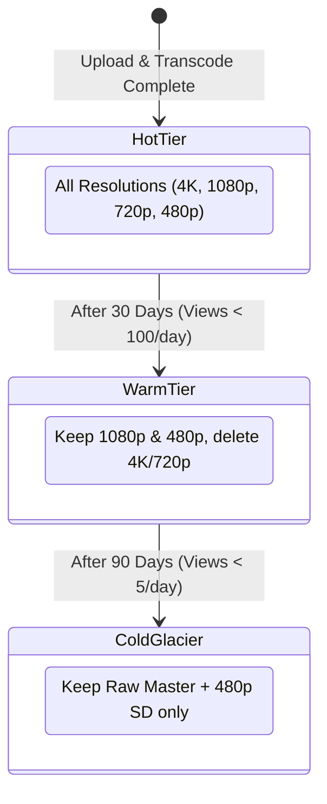

# CDN & Edge Caching Strategy

Video streaming represents the single largest consumer of Internet bandwidth. This document details how edge point-of-presence (PoP) networks, range-based caching, and origin shielding minimize transit costs while maximizing Quality of Experience (QoE).

---

## 1. Multi-Tiered Content Delivery Architecture



### Why Use an Origin Shield?
Without an Origin Shield, if 200 global PoP servers experience a cache miss for a newly released video chunk simultaneously, 200 concurrent requests hit the origin S3 bucket.
With an Origin Shield, PoPs query the Shield; only **1 request** hits S3, and the Shield fans the content out to all 200 PoPs.

---

## 2. HTTP Byte-Range Caching (`206 Partial Content`)

Video players frequently seek (jump ahead 5 minutes) or start streaming without needing the entire file immediately.

### Range Request Header Flow
```http
GET /videos/vid_101/1080p.mp4 HTTP/1.1
Host: cdn.streamhub.com
Range: bytes=0-2097151
```

### CDN Response
```http
HTTP/1.1 206 Partial Content
Content-Range: bytes 0-2097151/524288000
Content-Length: 2097152
Cache-Control: public, max-age=31536000, immutable
ETag: "seg_101_1080p_part1"
```

* **Immutable Segments**: Because video segments (`segment_001.ts`) are static and never change once encoded, they are marked with `max-age=31536000, immutable`. CDNs can keep them cached in local NVMe drives indefinitely.
* **Dynamic Manifests**: Manifest files (`master.m3u8`, `index.m3u8`) have short TTLs (`max-age=5` or `no-cache`) during live streams and medium TTLs (`max-age=3600`) for on-demand VOD.

---

## 3. Storage Tiering & Cold Data Lifecycle

Over 90% of views occur in the first 14 days of a video's upload. To minimize storage costs:



* **On-Demand JIT Transcoding for Cold Videos**: If an ancient cold video suddenly goes viral, an async task pulls the raw master from Glacier and re-transcodes modern 1080p segments in real time.
