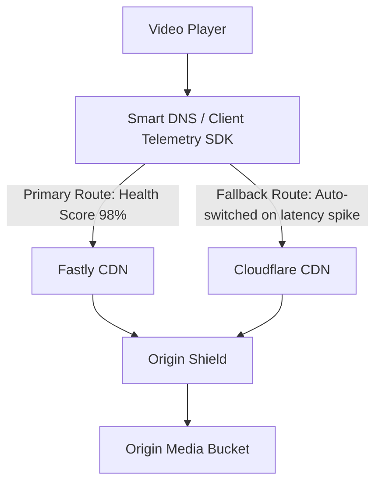

# Failure Scenarios & Resilience Engineering

This document analyzes system failure modes, blast radiuses, and self-healing recovery strategies across the video streaming pipeline.

---

## 1. Failure Modes & Mitigations Matrix

| Failure Mode | Impact | Detection Mechanism | Automated Mitigation / Recovery |
| :--- | :--- | :--- | :--- |
| **Creator upload connection drops at 98%** | Incomplete file in S3 | Client-side timeout / socket drop | Client resumes multipart upload from the last unacknowledged part using the original `upload_id`. No work lost. |
| **Transcoder worker crashes (OOM / Spot Term)** | Incomplete chunk encoding | Redis lease expiry (no heartbeat for 60s) | DAG Coordinator detects un-leased chunk, re-queues task to another worker node. Chunk writes are idempotent. |
| **Corrupted input video / Malformed codec** | Transcoding failure | FFmpeg exit code $\ne 0$ | Worker marks task as `FATAL_ERROR`, avoids infinite retry loops, and sets video status to `FAILED_CORRUPT_SOURCE`. |
| **Primary CDN PoP outage** | Viewers in region face 5xx / timeout | Global Synthetic CDN Probing & Real-User Monitoring (RUM) | Geo-DNS / Anycast routes traffic immediately to secondary CDN provider (Multi-CDN failover). |
| **Origin S3 rate limiting (503 Slow Down)** | High chunk miss latency | CloudWatch 503 error rate metrics | Origin Shield caches hot chunks; workers apply exponential backoff with full jitter on origin writes. |
| **Database outage (Metadata DB down)** | Search & comments unavailable | Healthcheck probe fails | Read-only cache layer (Redis + CDN) continues serving video playback manifests and cached metadata without downtime. |

---

## 2. Multi-CDN Failover Strategy

To ensure 99.999% global playback availability, the system employs an active-active Multi-CDN architecture (e.g., Cloudflare + Fastly + CloudFront):

* **Client-Side Fallback**: The video player SDK detects consecutive chunk download timeouts (>3 seconds). If 2 consecutive chunks fail on CDN A, the player automatically rewrites URLs to point to CDN B.
