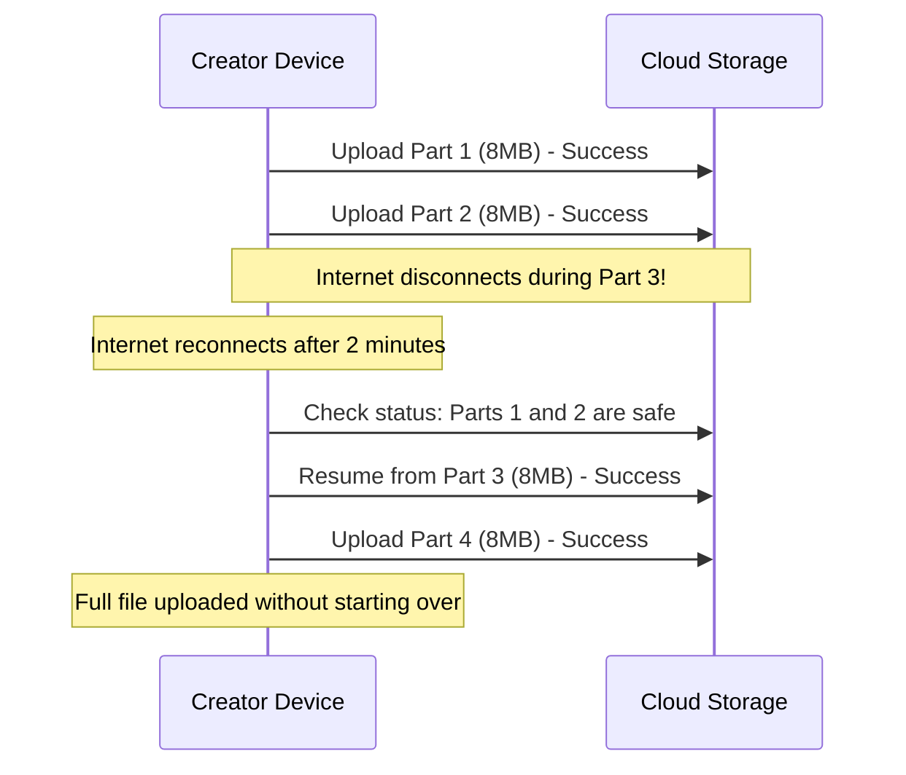

# Failure Scenarios & Recovery

This document explains what happens when different parts of the system break and how the system recovers automatically.

---

## 1. Common Failures and How the System Fixes Them

| What Went Wrong | What Happens | How the System Recovers |
| :--- | :--- | :--- |
| **Creator upload gets cut off at 95%** | Network drops on mobile/home Wi-Fi | The browser remembers which parts finished and resumes uploading only the missing 5%. |
| **A worker computer crashes during conversion** | A 4-second slice is half-processed | The worker's 60-second lease expires in Redis. The system notices this and assigns the slice to another working computer. |
| **Corrupted raw video file uploaded** | The video decoder cannot open the file | The worker marks the task as failed immediately with a clear error message, preventing endless retry loops. |
| **A local CDN server goes down** | Users in that city get errors | Smart DNS automatically redirects traffic to the next closest healthy city server in seconds. |
| **The main database goes down temporarily** | Search and comments are slow | Users can still stream videos without interruption because video playlists and files are cached independently on CDNs. |

---

## 2. Zero-Loss Upload Resumption

