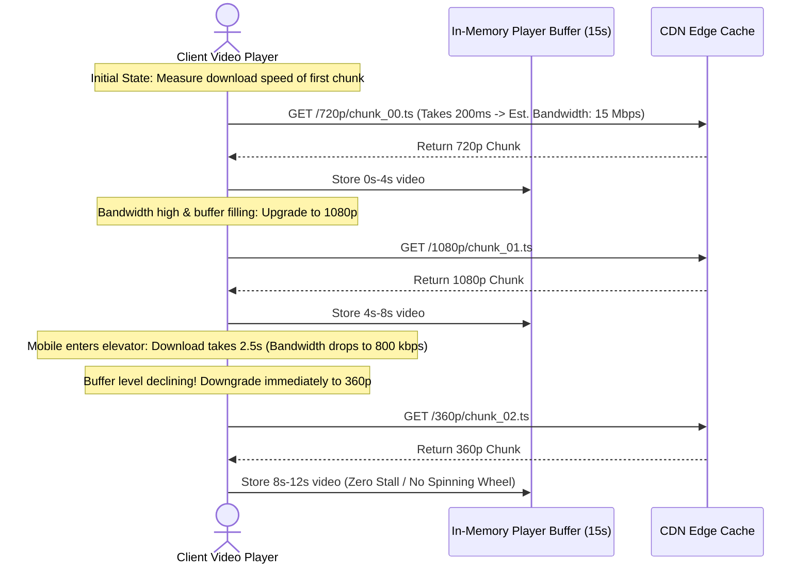

# Adaptive Bitrate Streaming: HLS & MPEG-DASH

This document details how client video players dynamically adapt streaming resolution based on fluctuating network conditions without interrupting playback.

---

## 1. Protocols Overview: HLS vs. MPEG-DASH

| Feature | HLS (HTTP Live Streaming) | MPEG-DASH (Dynamic Adaptive Streaming over HTTP) |
| :--- | :--- | :--- |
| **Origin / Standard** | Apple Standard (RFC 8216) | ISO/IEC 23009-1 Standard |
| **Index / Manifest File** | `.m3u8` (UTF-8 M3U format) | `.mpd` (XML format) |
| **Media Segment Formats** | `.ts` (MPEG-2 Transport Stream) / `.fmp4` | `.m4s` (Fragmented MP4) |
| **Platform Support** | iOS, Safari, Android, Smart TVs, Web (via hls.js) | Android, Chrome, Firefox, Smart TVs (via dash.js) |
| **Modern Recommendation** | Use **CMAF (Common Media Application Format)** to share single `.fmp4` chunks across both HLS & DASH. |

---

## 2. Adaptive Bitrate (ABR) Mechanics

Adaptive Bitrate Streaming shifts the complexity of quality selection to the **client-side player**.



---

## 3. Client ABR Decision Algorithms

Modern video players (e.g., Shaka Player, Hls.js, ExoPlayer) use hybrid adaptation algorithms:

### 1. Throughput-Based Adaptation (Rate-Based)
* Calculates smoothed moving average of download bandwidth:
  $$\text{Throughput} = \frac{\text{Segment Size in Bits}}{\text{Download Time (sec)}}$$
* Switches to the highest available bitrate variant that is $\le 80\%$ of estimated throughput (with 20% safety headroom).

### 2. Buffer-Based Adaptation (BBA)
* Ignores volatile bandwidth estimates and focuses solely on the **Player Buffer Occupancy**:
  * **Buffer < 5s (Danger Zone)**: Drop immediately to lowest bitrate (240p/360p) to avoid playback stalls.
  * **Buffer 5s - 15s (Comfort Zone)**: Maintain current quality.
  * **Buffer > 15s (Rich Zone)**: Step up quality to 1080p / 4K.

---

## 4. Master Playlist & Variant Playlist Hierarchy

```text
master.m3u8 (Root Manifest)
│
├── 1080p_manifest.m3u8 ──► [seg_000.ts, seg_001.ts, seg_002.ts ...]
├── 720p_manifest.m3u8  ──► [seg_000.ts, seg_001.ts, seg_002.ts ...]
├── 480p_manifest.m3u8  ──► [seg_000.ts, seg_001.ts, seg_002.ts ...]
└── audio_manifest.m3u8 ──► [audio_000.aac, audio_001.aac ...]
```

When a user requests playback:
1. The player downloads `master.m3u8`.
2. Inspects available `#EXT-X-STREAM-INF` tags (resolutions, bitrates, audio tracks).
3. Requests the initial variant playlist (e.g., `720p_manifest.m3u8`).
4. Continuously requests individual `.ts` chunks as the user watches.
