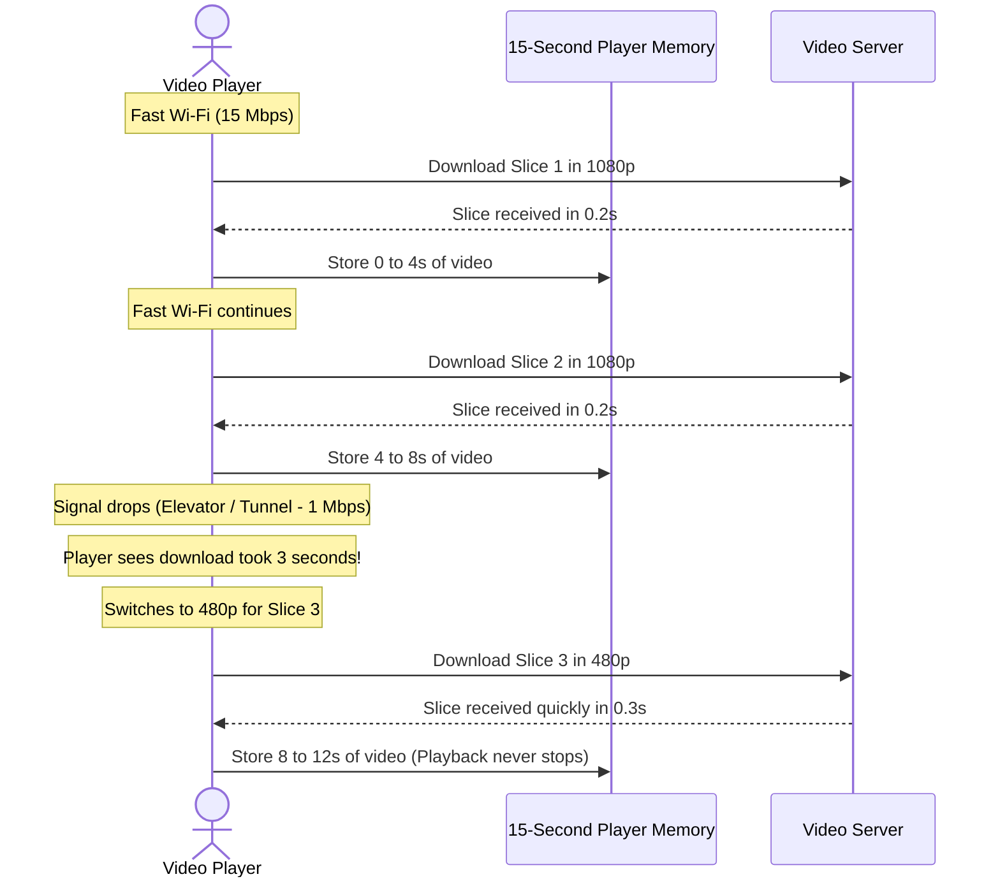

# Adaptive Bitrate Streaming (HLS & DASH)

This document explains how streaming protocols like HLS and DASH work to prevent video buffering on fluctuating internet connections.

---

## 1. What are HLS and DASH?

Instead of downloading one giant MP4 video file, modern video websites use streaming protocols:
* **HLS (HTTP Live Streaming):** Developed by Apple. Uses a text playlist file ending in `.m3u8` and video slices ending in `.ts` or `.mp4`.
* **MPEG-DASH:** An international open standard. Uses an XML playlist file ending in `.mpd` and video slices ending in `.m4s`.

Both protocols do the same job: they divide a video into short 4-second pieces and list all available quality versions in a playlist file.

---

## 2. How Quality Changes Automatically (Adaptive Streaming)

---

## 3. The Two Rules the Video Player Follows

Your phone or browser video player follows two simple rules while streaming:

### Rule 1: Measure Download Speed
Whenever the player finishes downloading a slice, it calculates how many megabytes were received per second. If there is enough bandwidth, it stays at 1080p or moves up to 4K.

### Rule 2: Protect the Buffer
The player keeps 10 to 15 seconds of upcoming video stored in your device's memory (the buffer):
* **Buffer Full (More than 10 seconds ahead):** The player is safe and requests the highest quality.
* **Buffer Low (Less than 4 seconds left):** The player immediately drops quality to 360p or 480p so that video keeps playing without any freeze.
