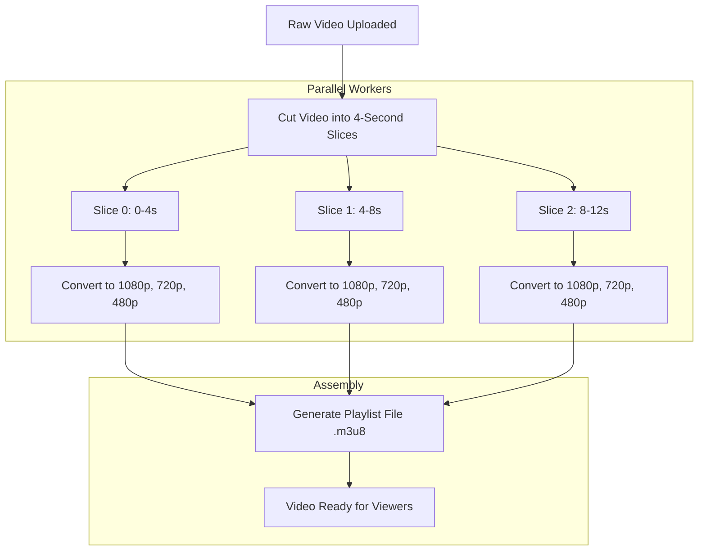

# Video Processing Pipeline (Transcoding)

This document explains how large raw video files are sliced, converted into multiple resolutions in parallel, and stitched together into streaming playlists.

---

## 1. Why Not Convert Videos as a Single File?

If we try to convert a long video (e.g. a 60-minute podcast) on a single server without splitting it:
1. **It takes too long:** The user must wait 30 to 45 minutes before they can watch even the first few seconds.
2. **Server Crashes Waste Work:** If the server crashes at minute 59, all 59 minutes of work are lost, and the conversion has to restart from the beginning.
3. **Slow Queues:** Long videos block the queue, forcing short 30-second clips to wait behind them.

---

## 2. The Solution: Parallel Slice Processing

### How the Slicing Works:
1. **Keyframe Alignment:** Video can only be cut safely at complete picture frames (called Keyframes or I-frames). The splitter cuts the file cleanly every 4 seconds.
2. **Distributed Tasks:** Each 4-second slice is placed into a task queue.
3. **Parallel Conversion:** Worker computers take slices from the queue and convert them simultaneously. A 10-minute video with 150 slices can be processed by 30 workers in under 1 minute.
4. **Generating Playlists:** Once all slices are converted, a master playlist file (`master.m3u8`) is created to link all slices together.

---

## 3. Worker Safety and Retries

* Each worker computer takes a temporary lease (e.g., 60 seconds) on a slice.
* If a worker runs out of memory or reboots, its lease expires.
* The system detects that the slice was not finished and gives it to another healthy worker.
* No data is lost, and the rest of the slices continue converting without interruption.
