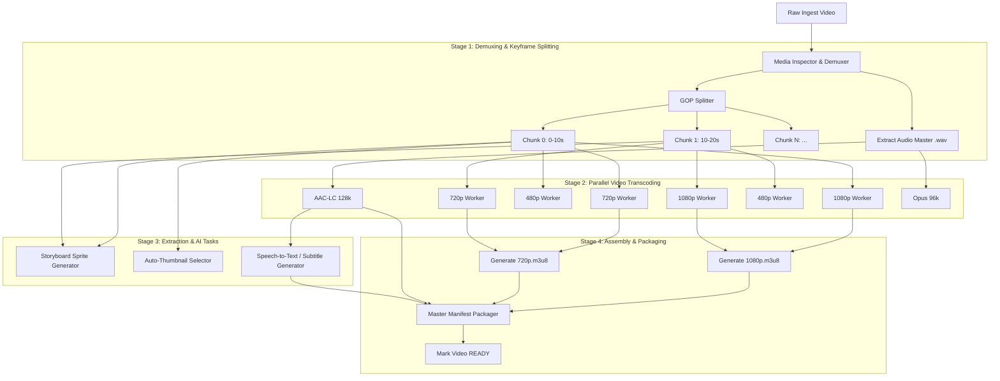
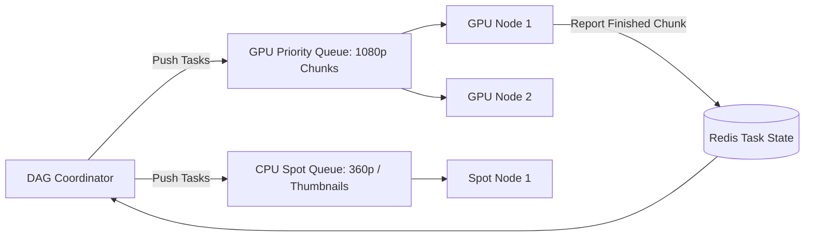

# Distributed Transcoding Pipeline & DAG Orchestration

This document details how large raw media files are partitioned, dispatched across compute clusters, transcoded in parallel, and stitched into streaming manifests using Directed Acyclic Graph (DAG) workflows.

---

## 1. The Core Engineering Challenge

Monolithic video encoding fails at scale for three fundamental reasons:
1. **Head-of-Line Blocking**: Long videos (e.g., 2-hour podcasts) hog encoder nodes for hours, delaying short viral clips.
2. **Blast Radius of Crashes**: If an encoder crashes at minute 119 of a 120-minute video, the entire 2 hours of compute must be re-run from scratch.
3. **High Turnaround Latency**: A user must wait until the full video is encoded before they can even preview the first 10 seconds.

---

## 2. Chunk-Based Transcoding DAG Architecture

---

## 3. Keyframe (GOP) Alignment & Splitting

Video compression uses three frame types:
* **I-Frames (Intra-frames / Keyframes)**: Standalone complete images.
* **P-Frames (Predicted)**: Delta changes based on previous frames.
* **B-Frames (Bi-directional)**: Delta changes based on both preceding and succeeding frames.

> [!IMPORTANT]
> **Splitting Rule**: A video file can **ONLY** be cut on an **I-frame (Keyframe)**. If split on a P/B frame without reference frames, visual artifacts and decoding crashes occur.

### Closed GOP Enforcement
During transcoding, all output chunks are forced to use **Fixed Closed GOP** intervals (e.g., GOP size = 60 frames = exactly 2.000 seconds at 30fps).
This guarantees that:
1. Every segment starts with an IDR (Instantaneous Decoder Refresh) keyframe.
2. Segments across different resolutions (1080p vs 720p) have **identical temporal boundaries**, allowing seamless mid-stream ABR switching.

---

## 4. Worker Queue & Task Scheduling

The DAG is coordinated using a distributed orchestrator (e.g., Temporal / Apache Airflow / custom Kafka workers):

### Worker Lease & Failure Recovery
1. When a worker picks up a chunk task `(video_id, chunk_index, profile)`, it acquires a 60-second heartbeat lease in Redis.
2. If the worker encounters an OOM / node crash, the lease expires.
3. The DAG Scheduler re-queues the chunk task to another node with zero data loss.
4. Finished chunk segments are written directly to S3 under `s3://processed-media/{video_id}/{profile}/segment_{index}.ts`.
